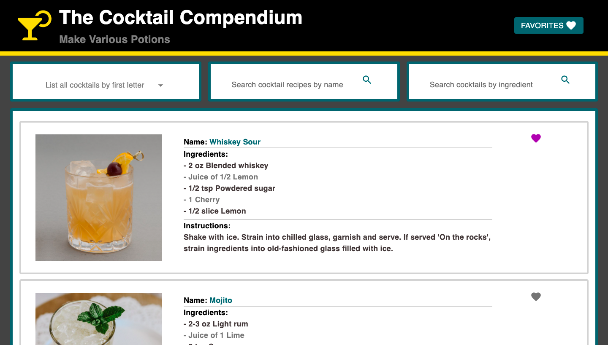

# Cocktail Compendium

<br/>

## A cocktail receipe application

<br/>

<!-- TABLE OF CONTENTS -->
<details open="open">
  <summary>Table of Contents</summary>
  <ol>
    <li><a href="##contributor">Contributor</a></li>
    <li>
      <a href="##about-the-project">About The Project</a>
      <ul>
        <li><a href="##tech-stack">Tech Stack</a></li>
      </ul>
    </li>
    <li>
      <a href="##getting-started">Getting Started</a>
      <ul>
        <li><a href="###prerequisites">Prerequisites</a></li>
        <li><a href="###installation">Installation</a></li>
      </ul>
    </li>
    <li><a href="##demo">Project Demo</a></li>
    <li><a href="##next-goals">Next Goals</a></li>
  </ol>
</details>
<br>

<!-- CONTACT -->

## Contributor

### Blake Hughes - blake.ed.hughes@gmail.com

 

[![linkedin-shield]][blake-linkedin]
[![github-shield]][blake-github]

<br><br>

<!-- ABOUT THE PROJECT -->

## About The Project

<br>
<div align="center">

</div><br><br>

Designed as an intuitive interface for searching cocktail recipes using a 3rd-party API, Cocktail Compendium allows users to search cocktail receipes by drink name, ingredient or first character. Additionally users can save items to a favorited list of receipes for later review.
In order to created this application in under 24 hours the functionality of key user stories and deployment were prioritized in order to avoid bike-shedding and showcase a minimum viable product.

<br>

## Tech Stack

- [React](https://reactjs.org/)
- [MaterialUI](https://mui.com/)
- [Axios](https://axios-http.com/)
- [Express](https://expressjs.com/)
- [Webpack](https://webpack.js.org/)

<br>


<br>

<!-- GETTING STARTED -->

## Getting Started

To explore the project, follow the instructions below.

### Prerequisites

- npm
  ```sh
  npm install npm@latest -g
  ```

### Installation

1. Clone the repo
   ```sh
   git clone https://github.com/blake-ed-hughes/MVP
   ```
2. Install NPM packages
   ```sh
   npm install
   ```
3. Compile Webpack
   ```sh
    npm run build
   ```
4. In another terminal run the express server on port: 3030
   ```sh
    npm start
   ```
5. Navigate to `localhost:3000` in your browser

<br><br>

## Project Demo

> ### Entering the App

<br>
<div align="center">

</div>
<br><br>

> ### Searching by first character

<br>
<div align="center">

</div>
<br><br>

> ### Searching by name

<br>
<div align="center">

</div>
<br><br>


## Next Goals

- Create a favorites page using React Router
- Persist user items by using a DBMS
- Create a "select random" cocktail feature and/or load a selection of random drinks upon entering the application

<!-- Contributor Links -->

[linkedin-shield]: https://img.shields.io/badge/-LinkedIn-grey?style=for-the-badge&logo=linkedin
[github-shield]: https://img.shields.io/badge/-GitHub-grey?style=for-the-badge&logo=github
[blake-linkedin]: https://www.linkedin.com/in/blakeedwardhughes/
[blake-github]: https://github.com/blake-ed-hughes
